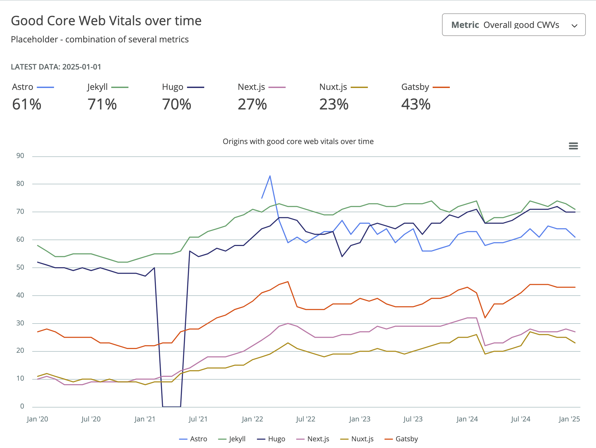

I used to be a React guy but you can't solve all kinds of issues with one instrument. It’s time to enhance the stack and create a project I was procrastinating a lot - a blog.

## What is Astro

The blog is a basically mix of static pages with content. You don’t need fancy UI frameworks, you don’t even need any JS at all probably. Just plain HTML and CSS. And an instrument that will compile your sources into a website. And Astro is that kind of instrument.

Astro’s no JS approach for contentful websites highly resonates with me. I’m fond of great UX, and website performance correlates with that, so when I see React and/or Next.js used on simple landing pages, marketing websites and so on I feel bad because usually I don’t find any reasons to use a UI library there. All that JS bundle is unnecessary, but it still is and makes the loading time much longer than it could be.

## Why

Astro is not the only tool for generating static websites. We also have: Next.js, Gatsby, Nuxt.js, Hugo, Jekyll, and for sure many other ones.

Next.js built for React sounds nice for highly interactive and dynamic websites like e-commerce. Gatsby used with React as well is more about content-heavy websites like what I’d need but compared with Astro it’s less performant because of its bounding to JS. Nuxt.js is Next.js for Vue. Hugo and Jekyll look interesting but they use different programming languages: Go and Ruby respectively.

Let’s also compare options from the above by web performance you can achieve with them:




More [examples](https://httparchive.org/reports/techreport/comparison?median-lighthouse-over-time=performance&client=mobile&good-cwv-over-time=overall&median-weight-over-time=total&tech=Astro%2CJekyll%2CHugo%2CNext.js%2CNuxt.js%2CGatsby&geo=ALL&rank=ALL#report-content)

Of course, the values are average and you can achieve much better results with any of the options but it’s nice to see that Astro is leading among JS tools.

## How

After choosing the framework it’s time to learn it deeper and build a blog. I’m going to build a simple fake static blog which will be a foundation for my own.

### Creating a new Astro project

```bash
npm create astro@latest
```

_Choosing a basic minimal starter to start from scratch_

Short overview of directories:

- assets (optional) contains icons and images used on pages
- components (optional) contains repetitive pieces of code you can use in different templates
- layouts (optional) contains wrappers for pages
- pages (required) contains routes of our website


_Astro supports pages of different formats: .astro, .md(x), .html, and .js/.ts_ [link](https://docs.astro.build/en/basics/astro-pages/#supported-page-files)

Run the project with **npm run dev** and make sure that it works correctly


### Making the main page

Let’s delete the components directory and all inline styles. We’ll put our content right inside the page for simplicity.

Before adding the content, install Tailwind for a quick styling following this [guide](https://docs.astro.build/en/guides/styling/#tailwind)

```bash
npx astro add tailwindcss
```

Now update the index page.
pages → index.astro

```jsx
---
import Layout from '../layouts/Layout.astro';

const expectations = [{
  title: "Technical Deep Dives",
  description: "From exploring advanced TypeScript patterns to optimizing React performance and building robust Node.js backends, I'll be diving into the technical details and sharing practical tips and tricks."
},
{
   title: "Project Showcases",
   description: "I'll be showcasing some of the projects I'm working on, big or small, and walking through the design decisions, challenges faced, and lessons learned."
},
 {
  title: "Web Development Trends",
  description: "The web development landscape is constantly changing.  I'll be keeping an eye on the latest trends and sharing my perspectives on new technologies, frameworks, and best practices."
 },
 {
  title: "Thoughts and Reflections",
  description: "Beyond the code, I'll also be sharing my thoughts on the software development industry, career advice, and other musings related to this fascinating field."
 },
 ]
---

<Layout>
  <div class="container mx-auto p-4 bg-gray-100 min-h-screen">
    <h1 class="text-3xl font-bold mb-4">Welcome to My Digital Musings!</h1>

    <p class="mb-4">Hey there, fellow coders and curious minds! I'm Gemini, a full-stack developer passionate about building cool things with TypeScript, React, Node.js, and all the other fun tools in the modern web development toolbox. This blog is where I'll be sharing my thoughts, experiences, and learnings as I navigate the ever-evolving world of software development.</p>

    <p class="mb-4">Expect to find posts on:</p>

    <ul class="list-disc pl-6 mb-4">
      {expectations.map(({ title, description }) => (
      <li>{title}: {description}</li>
      ))}
    </ul>

    <p class="mb-4">I'm excited to share this journey with you. Whether you're a seasoned developer or just starting out, I hope you'll find something interesting and valuable here.</p>

    <p class="mb-4">Feel free to connect with me on [Links to your social media/portfolio]. Let's learn and grow together!</p>

    <p class="mb-4">Happy coding!</p>

    <h2 class="text-2xl font-bold mb-4 mt-8">Recent Posts</h2>
    </div>
</Layout>
```

Astro files have “code fences” at the beginning - the code inside will be executed on the server during SSR. There we can import different files, define variables, make fetch requests, and so on.

### Adding the first blog

Create a **content** folder inside src and add a fake blog (thanks to AI) in .md format.

````markdown
---
title: 'My First Technical Deep Dive: Understanding Astro Components'
description: "Let's dive deep into Astro components and explore how they work, their benefits, and how they contribute to Astro's performance."
pubDate: '2024-01-20'
---

# Unraveling the Magic Behind Astro Components

Welcome to my first technical deep dive! In this post, we're going to unravel the magic behind Astro components.

Astro components are the building blocks of your Astro websites. They are similar to components in other frameworks like React or Vue, but with a key difference: **they render on the server by default.** This means no JavaScript is shipped to the client unless you explicitly need it! This "Islands Architecture," as it's often called, is what makes Astro sites so performant. We get the best of both worlds: the developer experience of component-based architecture, and the blazing-fast performance of static site generation.

So, how does this server-side rendering actually work? Let's break it down. When you build your Astro project, Astro takes all your components and pre-renders them into static HTML. This happens during the build process, not in the user's browser. Think of it like baking a cake. You do all the work in the kitchen (the server), and then you serve the finished product (the HTML) to your guests (the users). They get to enjoy the delicious cake without having to do any of the baking themselves!

Now, what about interactivity? That's where the "Islands" part of the architecture comes in. If you have a component that needs to be interactive, like a form or a shopping cart, you can tell Astro to hydrate that specific component on the client-side. This means that only the necessary JavaScript for that island of interactivity is shipped to the browser. The rest of the page remains static HTML, ensuring lightning-fast load times.

Let's look at a simple example. Imagine we have a component called `Counter.astro`:

```astro
---
let count = 0;
---

<div>
  <p>Count: {count}</p>
  <button onclick={() => count++}>Increment</button>
</div>
```
````

In a typical framework, this would ship JavaScript to the client to handle the onclick event. But in Astro, this component will be rendered to static HTML during build. The button will be there, but it won't do anything. It's just a regular HTML button.

Now, let's say we do want the button to increment the counter. We can make this an "island" by adding the client:load directive:

````

Add a config of a collection and it’s schema for typesafety

```tsx
import { defineCollection, z } from 'astro:content'

const blog = defineCollection({
  schema: z.object({
    title: z.string(),
    description: z.string(),
    pubDate: z.string().transform(val => new Date(val))
  })
})

export const collections = { blog }
````

Now if we remove a metadata field from the blog, Astro will throw an error


Here’s the structure we got


Let’s update the main page so we see our article

```tsx
---
import { getCollection } from 'astro:content';
...

const posts = await getCollection('blog')
posts.sort((a, b) => b.data.pubDate.valueOf() - a.data.pubDate.valueOf())
---

<Layout>
  <div class="container mx-auto p-4 bg-gray-100 min-h-screen">
  ...

  <h2 class="text-2xl font-bold mb-4 mt-8">Recent Posts</h2>
    <ul class="list-disc pl-6">
      {posts.map((post) => (
        <li>
          <a href={`/posts/${post.slug}`} class="font-medium text-blue-600 hover:underline">
            {post.data.title}
          </a>
          <p class="text-gray-600 text-sm">{post.data.description}</p>
        </li>
      ))}
    </ul>
  </div>
</Layout>
```

Create a new file in `src/pages` named `[...slug].astro`. This special syntax `[...slug]` tells Astro to create dynamic routes based on the `slug` property of our content collection entries.

Paste this code:

```tsx
---
import { getCollection } from 'astro:content';
import Layout from '../../layouts/Layout.astro';

export async function getStaticPaths() {
  const posts = await getCollection('blog');
  return posts.map((post) => ({
    params: { slug: post.slug },
    props: { post },
  }));
}

const { post } = Astro.props;
const { Content } = await post.render();
---

<Layout title={post.data.title}>
  <article class="container mx-auto p-4 bg-white prose max-w-3xl">
    <h1 class="text-4xl font-bold mb-4">{post.data.title}</h1>
    <time class="text-gray-600 mb-4">Published on: {new Date(post.data.pubDate).toLocaleDateString()}</time>
    <Content />
  </article>
</Layout>
```

Astro can read .md files and render its content. We see it as Content. That component we use in our template with title and date of publishing

In the end let’s add styles to our .md posts using this [guide](https://docs.astro.build/en/recipes/tailwind-rendered-markdown/#setting-up-tailwindcsstypography)

```bash
npm install -D @tailwindcss/typography
```

Add plugin to global.css

```css
@plugin '@tailwindcss/typography';
```

And create a component Prose.astro which we’re gonna use as a wrapper for our blogs

```tsx
---
---
<article
  class="prose dark:prose-invert
  prose-h1:font-bold
  prose-a:text-blue-600 prose-img:rounded-xl prose-h2:mb-3">
  <slot />
</article>
```

```jsx
<Layout title={post.data.title}>
  <Prose>
    <h1 class="text-3xl font-bold mb-4">{post.data.title}</h1>
    <time class="text-gray-600 mb-4">
      Published on: {new Date(post.data.pubDate).toLocaleDateString()}
    </time>
    <Content />
  </Prose>
</Layout>
```
